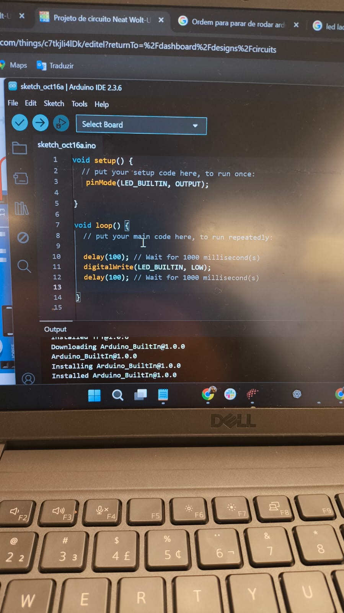
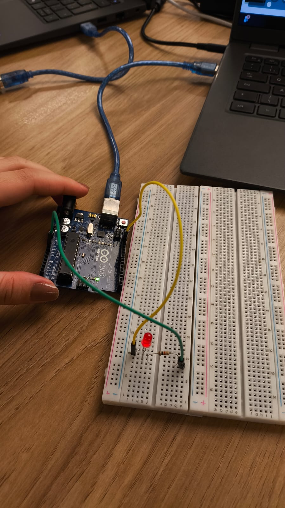
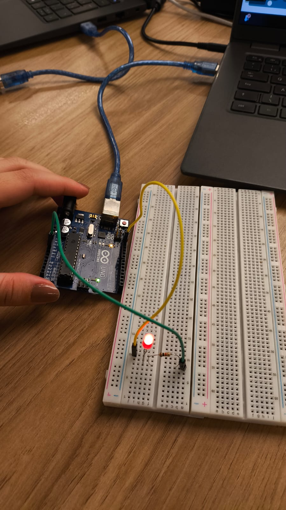

# Atividade Prática - Módulo 04

## 🧩 Parte 1 – Blink LED Interno

O objetivo foi realizar o **pisca-pisca (blink)** utilizando o **LED interno** do Arduino UNO.  
O LED foi programado para acender e apagar em intervalos definidos no código.

### 📸 Imagens

- **Código Arduino:**  
  

- **LED desligado:**  
  

- **LED ligado:**  
  

### 🎥 Vídeos

- [Vídeo 1 – Blink funcionando](parte1/parte1_funcionando.mp4)
- [Vídeo 2 – LED aceso](parte1/parte1_luz_acesa.mp4)

---

## 💡 Parte 2 – Simulação Blink Externo

Foi realizada uma simulação no **Tinkercad** com um **LED externo**, protoboard, resistor e Arduino UNO, reproduzindo o mesmo comportamento de pisca-pisca da Parte 1, mas com declaração de portas.

🔗 **Link da simulação no Tinkercad:**  
[Simulação - Blink Externo](https://www.tinkercad.com/things/c7tkjIi4lDk/editel?returnTo=%2Fdashboard%2Fdesigns%2Fcircuits&sharecode=wOoAq_3ipFSdTa9wCoBofVOMOeSfySkrGyPGaTVE5LI)

---

**Atividade realizada em:** 16/10 durante a instrução  
**Responsável:** Giovanna Neves Rodrigues
