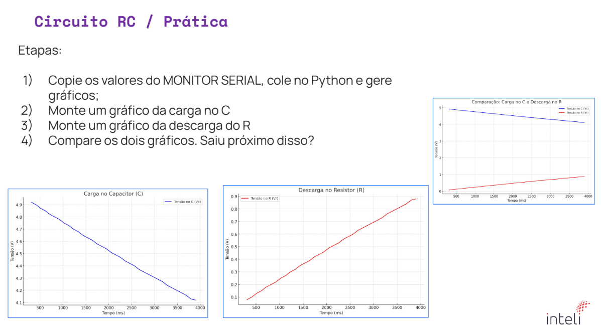
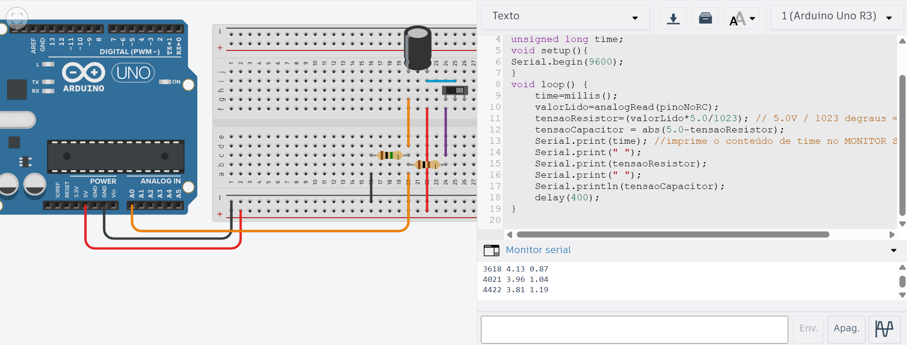
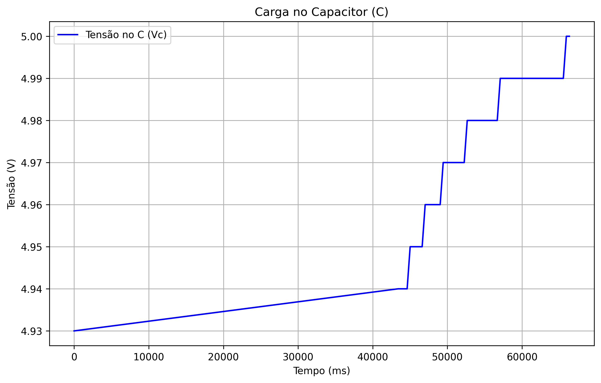
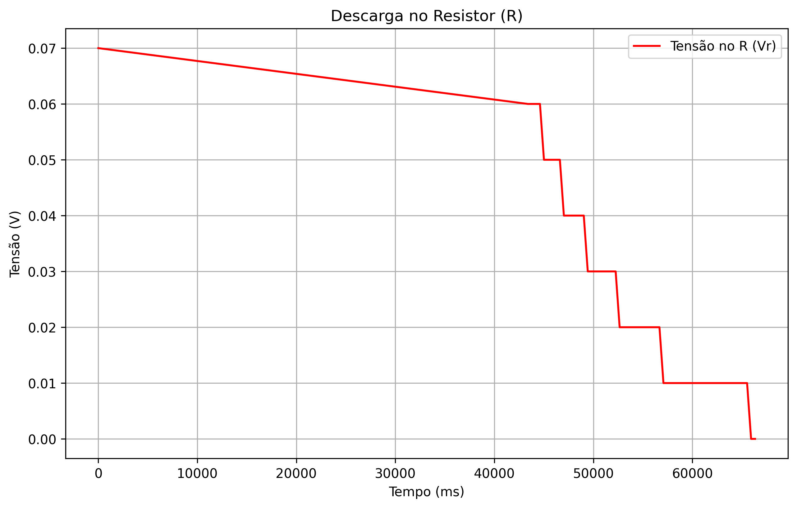
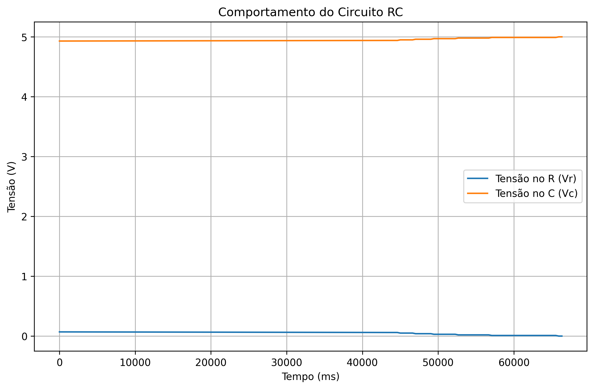

# Circuito RC — Prática

## Descrição da Atividade

Esta atividade tem como objetivo analisar o comportamento de um circuito RC (resistor e capacitor em série) durante os processos de carga e descarga.  
Por meio da leitura dos valores de tensão e tempo utilizando o Arduino, foi possível gerar gráficos no Python que representam a variação da tensão no resistor (Vr) e no capacitor (Vc) ao longo do tempo, comparando os resultados experimentais com o comportamento teórico esperado.

## Etapas da Atividade

1. Copiar os valores do **Monitor Serial** do Arduino.
2. Colar os valores no Python e gerar os gráficos.
3. Montar um gráfico da **carga no capacitor (Vc)**.
4. Montar um gráfico da **descarga no resistor (Vr)**.
5. Comparar os dois gráficos com o comportamento esperado do circuito RC.

## Código Arduino Utilizado

```cpp
int pinoNoRC=0;
int valorLido = 0;
float tensaoCapacitor = 0, tensaoResistor;
unsigned long time;
void setup(){
Serial.begin(9600);
}
void loop() {
	time=millis();
	valorLido=analogRead(pinoNoRC);
	tensaoResistor=(valorLido*5.0/1023); // 5.0V / 1023 degraus = 0.0048876
	tensaoCapacitor = abs(5.0-tensaoResistor);
 	Serial.print(time); //imprime o conteúdo de time no MONITOR SERIAL
    Serial.print(" ");
  	Serial.print(tensaoResistor);
  	Serial.print(" ");
  	Serial.println(tensaoCapacitor);
	delay(400);
}
```

O código mede a tensão no resistor (Vr) pelo pino analógico A0 e calcula a tensão no capacitor (Vc = 5 - Vr).

Esses valores são enviados ao monitor serial no formato:

_tempo Vr Vc_

Os dados coletados foram posteriormente utilizados no Python para gerar os gráficos.

## Código Python para análise

```py
import matplotlib.pyplot as plt

# --- Dados ---
dados = [
    (45, 0.07, 4.93),
    (43448, 0.06, 4.94),
    (43850, 0.06, 4.94),
    (44253, 0.06, 4.94),
    (44655, 0.06, 4.94),
    (45057, 0.05, 4.95),
    (45459, 0.05, 4.95),
    (45861, 0.05, 4.95),
    (46264, 0.05, 4.95),
    (46666, 0.05, 4.95),
    (47069, 0.04, 4.96),
    (47471, 0.04, 4.96),
    (47874, 0.04, 4.96),
    (48276, 0.04, 4.96),
    (48678, 0.04, 4.96),
    (49080, 0.04, 4.96),
    (49482, 0.03, 4.97),
    (49885, 0.03, 4.97),
    (50287, 0.03, 4.97),
    (50690, 0.03, 4.97),
    (51092, 0.03, 4.97),
    (51494, 0.03, 4.97),
    (51897, 0.03, 4.97),
    (52299, 0.03, 4.97),
    (52702, 0.02, 4.98),
    (53103, 0.02, 4.98),
    (53506, 0.02, 4.98),
    (53908, 0.02, 4.98),
    (54310, 0.02, 4.98),
    (54713, 0.02, 4.98),
    (55115, 0.02, 4.98),
    (55518, 0.02, 4.98),
    (55920, 0.02, 4.98),
    (56323, 0.02, 4.98),
    (56724, 0.02, 4.98),
    (57126, 0.01, 4.99),
    (57529, 0.01, 4.99),
    (57931, 0.01, 4.99),
    (58334, 0.01, 4.99),
    (58736, 0.01, 4.99),
    (59139, 0.01, 4.99),
    (59541, 0.01, 4.99),
    (59943, 0.01, 4.99),
    (60346, 0.01, 4.99),
    (60747, 0.01, 4.99),
    (61150, 0.01, 4.99),
    (61552, 0.01, 4.99),
    (61955, 0.01, 4.99),
    (62357, 0.01, 4.99),
    (62759, 0.01, 4.99),
    (63162, 0.01, 4.99),
    (63564, 0.01, 4.99),
    (63967, 0.01, 4.99),
    (64369, 0.01, 4.99),
    (64771, 0.01, 4.99),
    (65173, 0.01, 4.99),
    (65575, 0.01, 4.99),
    (65978, 0.00, 5.00),
    (66380, 0.00, 5.00)
]

# Separando dados
x = [item[0] for item in dados]
x = [t - x[0] for t in x]
y1 = [item[1] for item in dados]
y2 = [item[2] for item in dados]

# Gráfico 1: Geral
plt.figure(figsize=(10, 6))
plt.plot(x, y1, label='Tensão no R (Vr)')
plt.plot(x, y2, label='Tensão no C (Vc)')
plt.xlabel('Tempo (ms)')
plt.ylabel('Tensão (V)')
plt.title('Comportamento do Circuito RC')
plt.legend()
plt.grid(True)
plt.savefig('grafico_geral.png', dpi=300, bbox_inches='tight')
plt.close()

# Gráfico 2: Carga no Capacitor
plt.figure(figsize=(10, 6))
plt.plot(x, y2, 'b', label='Tensão no C (Vc)')
plt.xlabel('Tempo (ms)')
plt.ylabel('Tensão (V)')
plt.title('Carga no Capacitor (C)')
plt.legend()
plt.grid(True)
plt.savefig('grafico_capacitor.png', dpi=300, bbox_inches='tight')
plt.close()

# Gráfico 3: Descarga no Resistor
plt.figure(figsize=(10, 6))
plt.plot(x, y1, 'r', label='Tensão no R (Vr)')
plt.xlabel('Tempo (ms)')
plt.ylabel('Tensão (V)')
plt.title('Descarga no Resistor (R)')
plt.legend()
plt.grid(True)
plt.savefig('grafico_resistor.png', dpi=300, bbox_inches='tight')
plt.close()

print("Gráficos salvos como 'grafico_geral.png', 'grafico_capacitor.png' e 'grafico_resistor.png'")
```

## Conclusão

Os resultados obtidos mostram que o comportamento do circuito RC segue o modelo teórico esperado.
Durante a carga, a tensão no capacitor aumenta progressivamente até atingir o valor da fonte (aproximadamente 5 V), enquanto a tensão sobre o resistor diminui conforme a corrente decai.
Nos gráficos de descarga, o comportamento é inverso: o capacitor libera a energia acumulada, e a tensão sobre o resistor aumenta temporariamente.
Essa análise comprova a relação complementar entre Vr e Vc e demonstra o funcionamento característico do circuito RC, em que a corrente e as tensões variam de forma exponencial com o tempo.

## Resultados Obtidos

### Descrição da Atividade



### Protótipo Montado



### Gráfico: Carga no Capacitor (C)



### Gráfico: Descarga no Resistor (R)



### Gráfico: Comparação Geral



## Autora

Giovanna Neves Rodrigues
Inteli – Instituto de Tecnologia e Liderança
