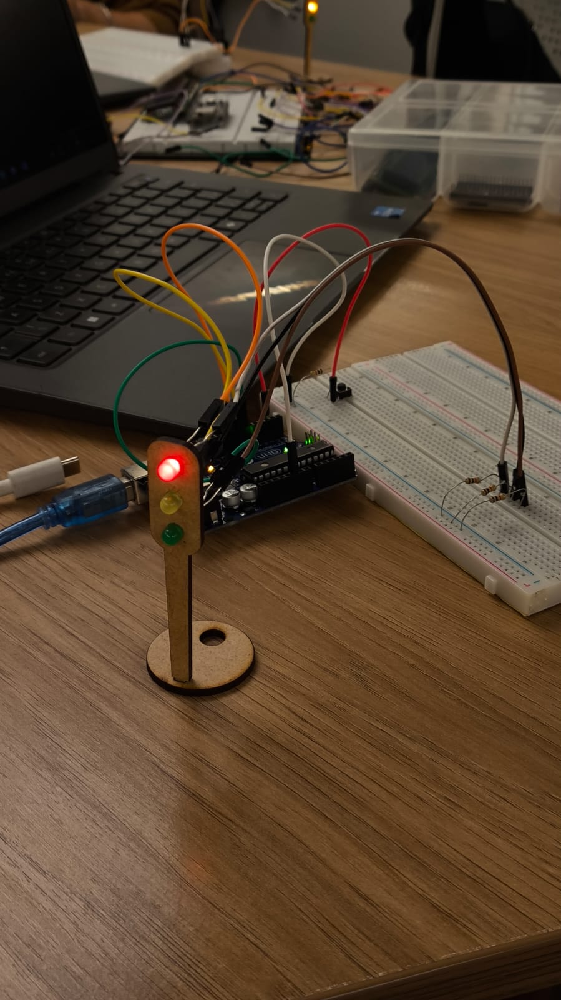
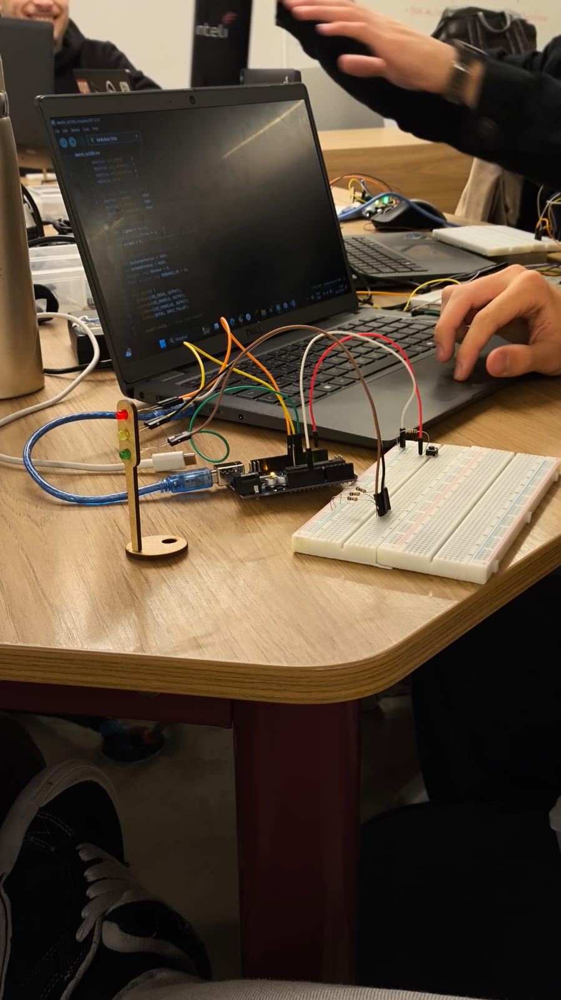
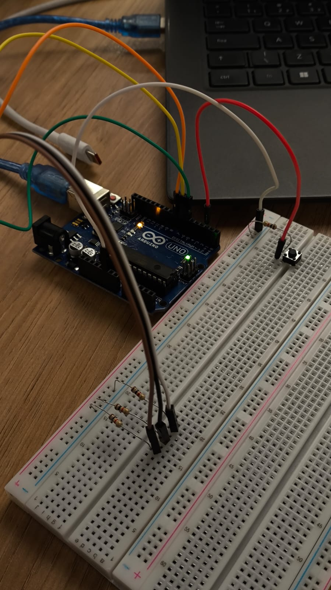

# 🚦 Projeto: Semáforo com Controle de Botão

## Contexto da Atividade

Esta atividade foi realizada durante as aulas de **Computação**, com o objetivo de aplicar os conceitos de **eletrônica digital, lógica de programação e controle temporal** em sistemas embarcados.

O cenário proposto simula um **semáforo urbano no bairro do Butantã**, onde o aluno deve desenvolver um sistema que garanta a segurança de pedestres e veículos. Apesar de o contexto ser fictício, o projeto representa um sistema real de **controle de fluxo viário**, amplamente utilizado em cidades.

---

## Objetivos de Aprendizagem

- Compreender o funcionamento de um **semáforo eletrônico** e suas fases.
- Desenvolver um **circuito físico funcional** utilizando LEDs, resistores, botão e Arduino.
- Implementar **lógica de controle** com tempos definidos para cada cor.
- Aplicar **estruturas de repetição**, **condições** e **controle de estados** em C++.
- Demonstrar o funcionamento do sistema por meio de vídeo e documentação.

---

## Componentes Utilizados

| Componente          | Quantidade | Função                     |
| ------------------- | ---------- | -------------------------- |
| LED Verde           | 1          | Indica "Siga"              |
| LED Amarelo         | 1          | Indica "Atenção"           |
| LED Vermelho        | 1          | Indica "Pare"              |
| Resistor            | 3          | Proteção dos LEDs          |
| Botão (Push Button) | 1          | Liga/desliga o sistema     |
| Arduino UNO         | 1          | Microcontrolador principal |
| Protoboard          | 1          | Base para montagem         |
| Jumpers             | Vários     | Conexões elétricas         |

---

## Montagem do Circuito

### Ligações:

- **LED Verde → pino 6**
- **LED Amarelo → pino 7**
- **LED Vermelho → pino 8**
- **Botão → pino 2** (ligado ao GND, utilizando `INPUT_PULLUP`)
- Todos os LEDs com resistores de 220 Ω conectados ao GND.

---

## Código Desenvolvido

```cpp
// ===== Pinos =====
#define LED_VERDE     6
#define LED_AMARELO   7
#define LED_VERMELHO  8
#define BOTAO         2

// ===== Tempos (ms) =====
#define T_VERDE       4000
#define T_AMARELO     2000
#define T_VERMELHO    6000

// ===== Variáveis =====
bool ligado = false;
unsigned long tTroca = 0;
int estado = 0; // 0=verde, 1=amarelo, 2=vermelho

// ===== Controle de debounce =====
int leituraAnterior = HIGH;
int estadoEstavel = HIGH;
unsigned long tBounce = 0;
const unsigned long DEBOUNCE_MS = 50;

void setup() {
  pinMode(LED_VERDE, OUTPUT);
  pinMode(LED_AMARELO, OUTPUT);
  pinMode(LED_VERMELHO, OUTPUT);
  pinMode(BOTAO, INPUT_PULLUP);

  apagarTudo(); // começa tudo apagado
}

void loop() {
  // ===== Leitura do botão com debounce =====
  int leitura = digitalRead(BOTAO);
  if (leitura != leituraAnterior) {
    tBounce = millis();
    leituraAnterior = leitura;
  }
  if (millis() - tBounce > DEBOUNCE_MS) {
    if (leitura != estadoEstavel) {
      estadoEstavel = leitura;
      if (estadoEstavel == LOW) {
        ligado = !ligado;
        if (ligado) {
          estado = 0;
          tTroca = millis();
        }
        aplicarEstado();
      }
    }
  }

  // ===== Lógica do semáforo =====
  if (ligado) {
    unsigned long agora = millis();
    unsigned long tempoAtual =
      (estado == 0) ? T_VERDE :
      (estado == 1) ? T_AMARELO : T_VERMELHO;

    if (agora - tTroca >= tempoAtual) {
      estado = (estado + 1) % 3; // avança estado
      tTroca = agora;
      aplicarEstado();
    }
  }
}

// ===== Funções auxiliares =====
void aplicarEstado() {
  apagarTudo();
  if (!ligado) return;

  if (estado == 0) digitalWrite(LED_VERDE, HIGH);
  else if (estado == 1) digitalWrite(LED_AMARELO, HIGH);
  else digitalWrite(LED_VERMELHO, HIGH);
}

void apagarTudo() {
  digitalWrite(LED_VERDE, LOW);
  digitalWrite(LED_AMARELO, LOW);
  digitalWrite(LED_VERMELHO, LOW);
}
```

---

## Lógica de Funcionamento

1. **Botão pressionado:** ativa o semáforo.
2. **Verde:** permanece aceso por 4 s.
3. **Amarelo:** acende por 2 s.
4. **Vermelho:** acende por 6 s.
5. O ciclo se repete indefinidamente até o botão ser pressionado novamente.

A lógica foi implementada com `millis()` para evitar travamentos e permitir resposta imediata do botão (sem `delay()`).

---

## Resultados

O sistema apresentou:

- Ciclo estável e funcional conforme os tempos definidos.
- Comportamento fluido e responsivo ao botão de controle.
- Montagem limpa e de fácil entendimento na protoboard.

---

## Registros Visuais

### Fotos do Circuito

> 

---

> 

---

> 

### Vídeo de Demonstração

> 🔗 [Assista à demonstração](./funcionando.mp4)

---

## Avaliação por Pares

**Nome do Avaliador:** Samuel Vono

| Critério                                | Descrição (segundo o barema)                                                                                                                                                                                                                      | Pontuação Máxima | Nota Atribuída | Observações                                                                                                                                                                                                                                                                                                                                                                                                                                           |
| --------------------------------------- | ------------------------------------------------------------------------------------------------------------------------------------------------------------------------------------------------------------------------------------------------- | ---------------- | -------------- | ----------------------------------------------------------------------------------------------------------------------------------------------------------------------------------------------------------------------------------------------------------------------------------------------------------------------------------------------------------------------------------------------------------------------------------------------------- |
| **Montagem Física**                     | Montagem física realizada com as cores corretas, boa disposição dos fios e uso adequado de resistores para proteção.                                                                                                                              | **4 pts**        | **3,6 pts**    | Montagem muito bem feita, porém os jumpers foram escolhidos da cor errada, ou seja, não utilizou aos jumpers pretos para GND, os jumpers vermelhos para VCC, entre outros.                                                                                                                                                                                                                                                                            |
| **Temporização / Medição de Tempo**     | Temporização adequada conforme tempos medidos com auxílio de algum instrumento externo (timer no celular por exemplo).                                                                                                                            | **3 pts**        | **2,4 pts**    | A lógica do código faz sentido e funciona, porém utilizou "modos" diferentes de se fazer o código, diferente do convencional que tornaria um entendimento maior do avaliador. Por exemplo, não utilizou funções separadas do loop que tornaria o código mais limpo e compreensível. Embora tenha algumas funções fora do loop(), a leitura do botão junto com a função do debounce poderia ter sido fora do loop(), garantindo uma código mais limpo. |
| **Implementação e Estrutura do Código** | O código implementa corretamente as fases do semáforo (vermelho, amarelo, verde) e as transições entre elas seguem a ordem correta. Além disso, o código tem boa estrutura, nomes representativos de variáveis e uso de comentários explicativos. | **3 pts**        | **3,0 pts**    | O código funciona apenas quando o botão enviar o sinal, comprovando que o código estpa funcionando e o semáforo mesmo depois de um bom tempo ligado, segue funcionando.                                                                                                                                                                                                                                                                               |

---

### Cálculo Final

**Nota Total = 3,6 + 2,4 + 3,0 = 9,0 pontos (de 10)**

---

### Observações Gerais

Já feitas.

---

**Nome do Avaliador:** Isabel Montenegro

| Critério                                | Descrição (segundo o barema)                                                                                                                                                                                                                      | Pontuação Máxima | Nota Atribuída | Observações                                          |
| --------------------------------------- | ------------------------------------------------------------------------------------------------------------------------------------------------------------------------------------------------------------------------------------------------- | ---------------- | -------------- | ---------------------------------------------------- |
| **Montagem Física**                     | Montagem física realizada com as cores corretas, boa disposição dos fios e uso adequado de resistores para proteção.                                                                                                                              | **4 pts**        | **3,5 pts**    | Montagem limpa e organizada, porém sem cores padrão. |
| **Temporização / Medição de Tempo**     | Temporização adequada conforme tempos medidos com auxílio de algum instrumento externo (timer no celular, por exemplo).                                                                                                                           | **3 pts**        | **3,0 pts**    | Tempos corretos no cronômetro.                       |
| **Implementação e Estrutura do Código** | O código implementa corretamente as fases do semáforo (vermelho, amarelo, verde) e as transições entre elas seguem a ordem correta. Além disso, o código tem boa estrutura, nomes representativos de variáveis e uso de comentários explicativos. | **3 pts**        | **3,0 pts**    | Código bem detalhado.                                |

---

### Cálculo Final

**Nota Total = 3,5 + 3,0 + 3,0 = 9,5 pontos (de 10)**

---

### Observações Gerais

Avaliação positiva: circuito e código bem executados, com pequenas observações apenas em relação ao padrão de cores na montagem.

## Conclusão

A atividade permitiu compreender o ciclo de controle de um semáforo e aplicar conceitos de **programação embarcada**, **eletrônica básica** e **debounce** em botões.
Além do desenvolvimento técnico, o exercício reforçou a importância da **clareza na montagem**, **organização do código** e **documentação do processo**.

## Autor

**Nome:** Giovanna Neves Rodrigues <br>
**Turma:** T17 – Inteli <br>
**Data:** 30/10 <br>
**Professor(a):** Crishna Irion <br>
